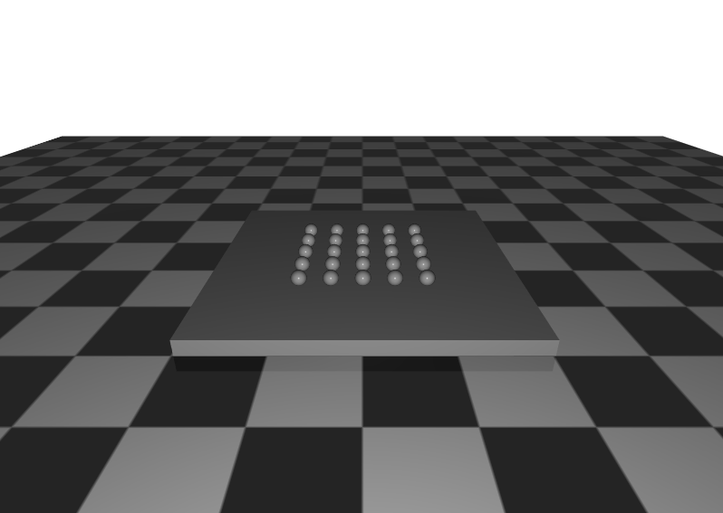

# Rolling test 

Rolling test is for testing frictional contact behavior. The error is measured by comparing the simulation with analytical solution.
The test focuses on:

1. Frictional cone (diagonal, elliptic)
2. The accuracy of frictional contact simulation
3. The violation of hard-contact constraint (penetration)
4. The effect of ERP (error-correcting)

## Test scenario 

- static ground
- 10 kg box on the ground
- 25 number of 1 kg balls on the box
- 150 N force applied to box in the xy direction  

## Tested solver list

- Rai 
    - Bisection solver (Rai solver)
- Bullet
    - Sequence impulse 
    - NNCG
    - MLCP Dantzig
    - MLCP PGS
- ODE
    - Standard
    - Quick 
- MuJoCo
    - PGS
    - CG
    - Newton 
- Dart
    - Dantzig
    - PGS

## Results

**Note. the pushing force resulted in no motion in ODE and Dart.**
**Note. the ODE standard solver 

<!---
#### With ERP

#### Without ERP

## Force along Y-direction 

#### With ERP

#### Without ERP

--->