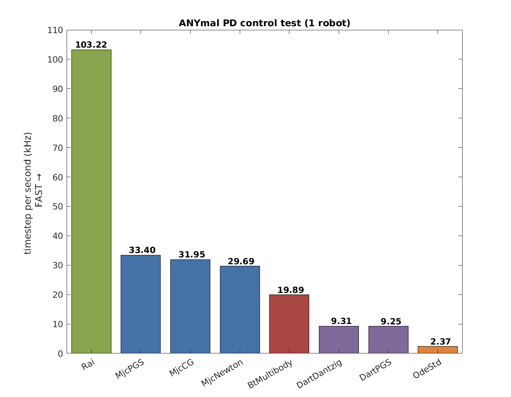

# ANYmal test

ANYmal test is for testing articulated robot system. In this test, the 18 DOF quadruped robot [ANYmal](http://www.rsl.ethz.ch/) is feedback-controlled to stand on the flat ground.  

The test focuses on:

1. Speed of the articulated system (multibody system with revolute joints) simulation
2. Scalability of the simulators

## Test scenario 

## Results 

